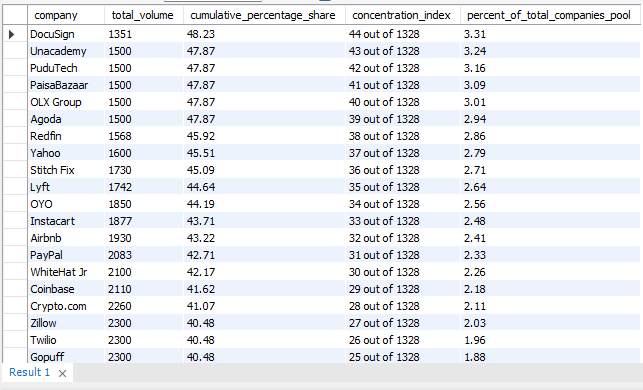

# SQL-Data-Analysis-Layoffs

Exploratory Data Analysis (EDA) on global layoff data using MySQL.

## 📌 Project Overview
This project performs a comprehensive Exploratory Data Analysis (EDA) on historical global tech layoff data. Moving beyond basic data retrieval, it utilizes advanced MySQL techniques to uncover macro-economic trends, sectoral vulnerabilities, and the concentration of economic impact among major industry players.

This repository serves as a **Universal EDA Blueprint** designed to be adapted to any transactional or volumetric dataset.

---

## 🛠️ Technical Toolkit & SQL Concepts Applied
* **Advanced Aggregations:** Utilizing `GROUP BY` and `HAVING` for granular data segmentation.
* **Time-Series Analysis:** Extracting chronological trends using `YEAR()` and `SUBSTRING()` functions.
* **Window Functions:** Calculating cumulative statistics with `SUM() OVER(ORDER BY...)` and sequence logic via `ROW_NUMBER()`.
* **Layered Common Table Expressions (CTEs):** Building multi-stage relational matrices to handle complex analytical pipelines.
* **Statistical Modeling:** Implementing the **Pareto Principle (80/20 Rule)** to isolate high-impact companies.

---

## 📋 The 10-Stage Analytical Framework
The SQL script (`Script/exploratory_data_analysis.sql`) is engineered into distinct phases:

1. **The Pulse Check:** Establishing quantitative extremes and temporal boundaries.
2. **Categorical Driver Aggregation:** Identifying high-impact industries and organizations.
3. **Macro-Level Time Series:** Isolating cyclical trends via Year-over-Year (YoY) and monthly bucketing.
4. **Cumulative Trajectory Modeling:** Building a global running total baseline.
5. **Impact Concentration (Pareto Matrix):** Mathematically isolating the critical few companies driving the majority of layoff volumes.

---

## 💡 Key Analytical Insights
* **Volatility Analysis:** What are the upper and lower boundaries of single-event layoffs?
* **Resilience Mapping:** Which industries proved resilient during initial waves?
* **Concentration Risk:** Is the economic damage spread across thousands of startups, or skewed by mega-cap corporations?

---

## SQL Exploratory Data Analysis Visualization

This visual represents the company impact distribution derived from our Pareto Analysis query:

